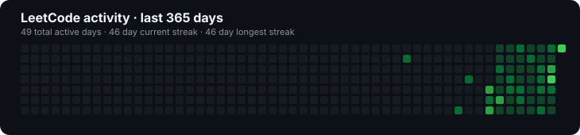

# LeetCode Solutions

A curated collection of my accepted solutions, coding activity, and problem-solving progress.

[View my LeetCode profile](https://leetcode.com/u/AryanGaur2504/)

## Progress

| Solved | Easy | Medium | Hard | Current streak | Active days |
|---:|---:|---:|---:|---:|---:|
| **51** | 23 | 25 | 3 | **35 days** | **38** |



## Highlights

- **Longest streak:** 35 days
- **Acceptance rate:** 71.4%
- **Ranking:** #2,810,644
- **Primary language:** C++
- **Active years:** 2026
- **Solutions archived:** 29

## Recent solutions

- [Pascal's Triangle II](pascal-s-triangle-ii/) · Easy · C++
- [Pascal's Triangle](pascal-s-triangle/) · Easy · C++
- [Find a Peak Element II](find-a-peak-element-ii/) · Medium · C++
- [Median of Two Sorted Arrays](median-of-two-sorted-arrays/) · Hard · C++
- [Remove Element](remove-element/) · Easy · C++
- [Delete Node in a Linked List](delete-node-in-a-linked-list/) · Medium · C++
- [Check Divisibility by Digit Sum and Product](check-divisibility-by-digit-sum-and-product/) · Easy · C++
- [Capacity To Ship Packages Within D Days](capacity-to-ship-packages-within-d-days/) · Medium · C++
- [Distribute Elements Into Two Arrays I](distribute-elements-into-two-arrays-i/) · Easy · C++
- [Find the Smallest Divisor Given a Threshold](find-the-smallest-divisor-given-a-threshold/) · Medium · C++

## LeetCode Topics

| Topic | Archived solutions |
|---|---:|
| Array | 25 |
| Binary Search | 15 |
| Dynamic Programming | 4 |
| Sorting | 4 |
| Hash Table | 3 |
| Divide and Conquer | 2 |
| Math | 2 |
| Two Pointers | 2 |
| Binary Indexed Tree | 1 |
| Enumeration | 1 |

_Showing the 10 most represented topics. The complete index is available below._

<details>
<summary><strong>Browse all 20 topics and linked solutions</strong></summary>

<br>

### Array · 25

[0004 · Median of Two Sorted Arrays](./median-of-two-sorted-arrays/) · [0027 · Remove Element](./remove-element/) · [0033 · Search in Rotated Sorted Array](./search-in-rotated-sorted-array/) · [0034 · Find First and Last Position of Element in Sorted Array](./find-first-and-last-position-of-element-in-sorted-array/) · [0035 · Search Insert Position](./search-insert-position/) · [0056 · Merge Intervals](./merge-intervals/) · [0081 · Search in Rotated Sorted Array II](./search-in-rotated-sorted-array-ii/) · [0088 · Merge Sorted Array](./merge-sorted-array/) · [0118 · Pascal's Triangle](./pascal-s-triangle/) · [0119 · Pascal's Triangle II](./pascal-s-triangle-ii/) · [0128 · Longest Consecutive Sequence](./longest-consecutive-sequence/) · [0152 · Maximum Product Subarray](./maximum-product-subarray/) · [0153 · Find Minimum in Rotated Sorted Array](./find-minimum-in-rotated-sorted-array/) · [0162 · Find Peak Element](./find-peak-element/) · [0410 · Split Array Largest Sum](./split-array-largest-sum/) · [0493 · Reverse Pairs](./reverse-pairs/) · [0704 · Binary Search](./binary-search/) · [0875 · Koko Eating Bananas](./koko-eating-bananas/) · [1011 · Capacity To Ship Packages Within D Days](./capacity-to-ship-packages-within-d-days/) · [1283 · Find the Smallest Divisor Given a Threshold](./find-the-smallest-divisor-given-a-threshold/) · [1482 · Minimum Number of Days to Make m Bouquets](./minimum-number-of-days-to-make-m-bouquets/) · [1901 · Find a Peak Element II](./find-a-peak-element-ii/) · [2996 · Smallest Missing Integer Greater Than Sequential Prefix Sum](./smallest-missing-integer-greater-than-sequential-prefix-sum/) · [3069 · Distribute Elements Into Two Arrays I](./distribute-elements-into-two-arrays-i/) · [3731 · Find Missing Elements](./find-missing-elements/)

### Binary Indexed Tree · 1

[0493 · Reverse Pairs](./reverse-pairs/)

### Binary Search · 15

[0004 · Median of Two Sorted Arrays](./median-of-two-sorted-arrays/) · [0033 · Search in Rotated Sorted Array](./search-in-rotated-sorted-array/) · [0034 · Find First and Last Position of Element in Sorted Array](./find-first-and-last-position-of-element-in-sorted-array/) · [0035 · Search Insert Position](./search-insert-position/) · [0081 · Search in Rotated Sorted Array II](./search-in-rotated-sorted-array-ii/) · [0153 · Find Minimum in Rotated Sorted Array](./find-minimum-in-rotated-sorted-array/) · [0162 · Find Peak Element](./find-peak-element/) · [0410 · Split Array Largest Sum](./split-array-largest-sum/) · [0493 · Reverse Pairs](./reverse-pairs/) · [0704 · Binary Search](./binary-search/) · [0875 · Koko Eating Bananas](./koko-eating-bananas/) · [1011 · Capacity To Ship Packages Within D Days](./capacity-to-ship-packages-within-d-days/) · [1283 · Find the Smallest Divisor Given a Threshold](./find-the-smallest-divisor-given-a-threshold/) · [1482 · Minimum Number of Days to Make m Bouquets](./minimum-number-of-days-to-make-m-bouquets/) · [1901 · Find a Peak Element II](./find-a-peak-element-ii/)

### Divide and Conquer · 2

[0004 · Median of Two Sorted Arrays](./median-of-two-sorted-arrays/) · [0493 · Reverse Pairs](./reverse-pairs/)

### Dynamic Programming · 4

[0118 · Pascal's Triangle](./pascal-s-triangle/) · [0119 · Pascal's Triangle II](./pascal-s-triangle-ii/) · [0152 · Maximum Product Subarray](./maximum-product-subarray/) · [0410 · Split Array Largest Sum](./split-array-largest-sum/)

### Enumeration · 1

[3345 · Smallest Divisible Digit Product I](./smallest-divisible-digit-product-i/)

### Greedy · 1

[0410 · Split Array Largest Sum](./split-array-largest-sum/)

### Hash Table · 3

[0128 · Longest Consecutive Sequence](./longest-consecutive-sequence/) · [2996 · Smallest Missing Integer Greater Than Sequential Prefix Sum](./smallest-missing-integer-greater-than-sequential-prefix-sum/) · [3731 · Find Missing Elements](./find-missing-elements/)

### Linked List · 1

[0237 · Delete Node in a Linked List](./delete-node-in-a-linked-list/)

### Math · 2

[3345 · Smallest Divisible Digit Product I](./smallest-divisible-digit-product-i/) · [3622 · Check Divisibility by Digit Sum and Product](./check-divisibility-by-digit-sum-and-product/)

### Matrix · 1

[1901 · Find a Peak Element II](./find-a-peak-element-ii/)

### Merge Sort · 1

[0493 · Reverse Pairs](./reverse-pairs/)

### Ordered Set · 1

[0493 · Reverse Pairs](./reverse-pairs/)

### Prefix Sum · 1

[0410 · Split Array Largest Sum](./split-array-largest-sum/)

### Segment Tree · 1

[0493 · Reverse Pairs](./reverse-pairs/)

### Simulation · 1

[3069 · Distribute Elements Into Two Arrays I](./distribute-elements-into-two-arrays-i/)

### Sorting · 4

[0056 · Merge Intervals](./merge-intervals/) · [0088 · Merge Sorted Array](./merge-sorted-array/) · [2996 · Smallest Missing Integer Greater Than Sequential Prefix Sum](./smallest-missing-integer-greater-than-sequential-prefix-sum/) · [3731 · Find Missing Elements](./find-missing-elements/)

### Treap · 1

[0493 · Reverse Pairs](./reverse-pairs/)

### Two Pointers · 2

[0027 · Remove Element](./remove-element/) · [0088 · Merge Sorted Array](./merge-sorted-array/)

### Union-Find · 1

[0128 · Longest Consecutive Sequence](./longest-consecutive-sequence/)

</details>

## Repository structure

```text
two-sum/
├── README.md
└── solution.cpp
```

Each folder contains the accepted solution and a concise explanation covering the approach, complexity, runtime, memory usage, and original submission date.
